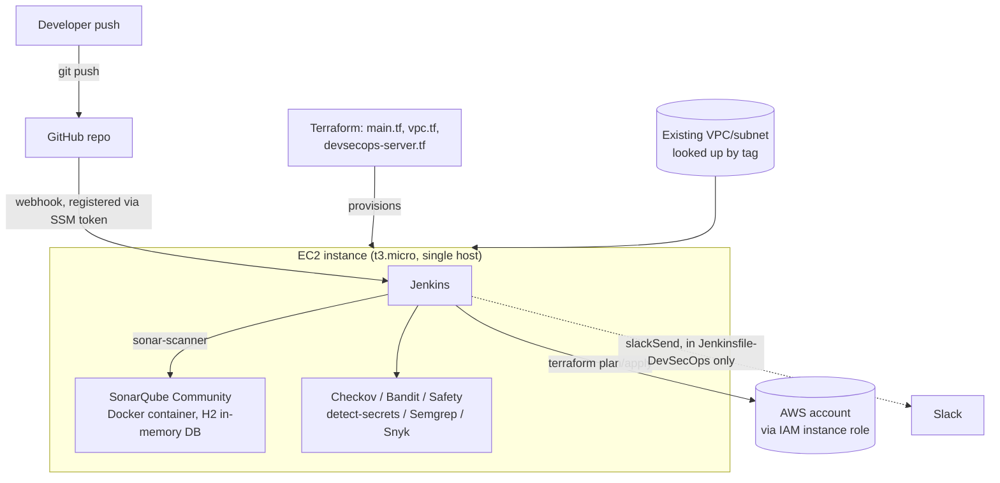

# DevSecOps Platform: Jenkins + SonarQube on a single EC2 host

[](https://github.com/soodrajesh/DevSecOps-Platform-Jenkins-SonarQube/actions/workflows/ci.yml)

Terraform stands up one EC2 instance in an existing AWS VPC, and a user-data script turns it into a Jenkins + SonarQube box with a handful of security scanners installed alongside. Two Jenkinsfiles live in the repo: a small one that just validates the codebase (Terraform fmt/validate, Python syntax, some grep-based checks), and a longer one that models a fuller pipeline with SonarQube quality gates, Checkov, OWASP Dependency-Check, and Slack notifications.

This started as a basic Terraform CI/CD lab (deploying a demo Apache app) and was repurposed into a DevSecOps toolchain demo. Some of that history is still visible in the code — an old app deployment script, a couple of stale repo-name references — and I've called those out below instead of pretending they aren't there.

## What it actually does

`terraform apply` creates:

- A security group allowing inbound 22, 80, 443, 8080 (Jenkins), and 9000 (SonarQube) from `0.0.0.0/0`.
- An IAM role/instance profile attached to the instance with a policy that grants `*` on EC2, S3, IAM, Lambda, CloudFormation, logs, CloudWatch, SNS, SQS, DynamoDB, RDS, ELB, ASG, Route53, ACM, Secrets Manager, SSM, and STS.
- One EC2 instance (`t3.micro` by default) in an existing VPC/subnet looked up by tag (`devopslab` / `public-subnet-0`), with an encrypted gp3 root volume and IMDSv2 enforced.
- An Elastic IP attached to that instance.

The instance's user-data script (`scripts/devsecops-setup.sh`) does the rest: installs Java 17, Jenkins, Docker, Docker Compose, Python 3, Node.js, Terraform, and the AWS CLI; installs Checkov, Bandit, Safety, detect-secrets, Semgrep, and Snyk into the `ec2-user` home directory; brings up SonarQube Community Edition via Docker Compose; installs a small set of Jenkins plugins over the HTTP API; and creates one starter pipeline job (`DevSecOps-Test`). It also drops a `monitor-devsecops.sh` script on the box that prints service status and both admin passwords in plaintext.

GitHub webhook registration is handled by a background script that sleeps 3 minutes, pulls a GitHub token out of SSM Parameter Store (`/github-auto-commit/github-token`), and calls the GitHub API to register a webhook pointed at the instance's public IP over plain HTTP (`insecure_ssl: "1"`, because there's no TLS in front of Jenkins).

## Architecture



Everything - Jenkins, SonarQube, and the scanning tools - runs on one host, which is the whole point: it's cheap and there's nothing to wire together beyond the user-data script. The tradeoff is that Jenkins and SonarQube compete for the same 1-2 vCPUs, SonarQube's data lives in an in-memory H2 database (the docker-compose file sets `SONAR_JDBC_URL: jdbc:h2:mem:sonar`), so a container restart loses all analysis history, and there's no separation between the build agent and the controller.

Compared to a managed alternative like SonarCloud or GitHub Advanced Security, this setup exists because it doesn't depend on a SaaS scanning quota or a GitHub Enterprise license, and everything - Jenkins config, SonarQube analysis, scanner versions - stays inside one box you fully control. You'd choose SonarCloud/CodeGuru instead if you wanted the scanning results to outlive a single EC2 instance, wanted proper RBAC and audit logging, or didn't want to own patching and backups for the scanning stack yourself.

## Known gaps

- **State is committed to the repo.** `terraform.tfstate` and `terraform.tfstate.backup` are tracked in git. `backend.tf` has a commented-out S3 backend (pointed at a `us-west-2` bucket, which doesn't match the `eu-west-1` region used everywhere else) but local state is what's actually in use. No locking, no encryption at rest for state, and anyone with repo access can see resource IDs and IPs.
- **The IAM policy attached to the instance is `*` on everything** listed above. That's far broader than what the setup script or either Jenkinsfile actually needs.
- **Security group is open to `0.0.0.0/0`** on SSH, Jenkins, and SonarQube. Fine for a personal lab, not something to point at a shared network.
- **No TLS.** Jenkins and SonarQube are both served over plain HTTP, and the webhook setup explicitly disables SSL verification (`insecure_ssl: "1"`) because of it.
- **Jenkins and SonarQube admin credentials aren't rotated or stored anywhere secure.** `monitor-devsecops.sh` prints the Jenkins initial admin password and the default SonarQube `admin/admin` login straight to the terminal.
- **`Jenkinsfile-DevSecOps` assumes plugins and credentials that the setup script never installs.** It uses `withSonarQubeEnv`, `waitForQualityGate()`, the OWASP `dependencyCheck` step, `slackSend`, and a `github-repo-url` credential - none of which are configured by `devsecops-setup.sh`. You have to wire those up by hand in the Jenkins UI before that pipeline will run past the first stage.
- **`github_webhook_secret` and `sonarqube_admin_password` are declared in `vars.tf` but never consumed anywhere.** They read like configurable settings; they aren't plumbed into any resource or script.
- **Single point of failure, no HA.** One instance, no auto-recovery, no backups of Jenkins home or SonarQube data beyond what's on the root volume.
- **The sample Flask app isn't deployed by anything.** `sample-app/` gets a Python syntax check in the simple `Jenkinsfile` (`python3 -m py_compile app.py`) and that's it - there's no step that builds the Docker image, pushes it anywhere, or runs it.
- **Manual GitHub token setup.** The webhook automation only works if you've manually put a GitHub PAT into SSM Parameter Store first; there's no Terraform resource or script that does that for you.
- **Left over from an earlier version of this repo:** the README and a couple of scripts (`Jenkinsfile`'s `SONARQUBE_PROJECT_KEY`, `scripts/devsecops-setup.sh`'s `GITHUB_REPO`, `scripts/run-on-ec2.sh`) still reference the project's old name, `ci-cd-project-3`. They don't break anything functionally, but they're stale.
- **GitHub Actions CI only lints and validates, it doesn't deploy anything.** `.github/workflows/ci.yml` runs on every push/PR to `main` with three jobs, none of which need AWS credentials: `terraform fmt -check` + `terraform init -backend=false` + `terraform validate` (validate doesn't touch state or AWS, so the committed `terraform.tfstate` doesn't interfere); `shellcheck` (at `--severity=error`, so it catches real script bugs, not the pre-existing style/info-level warnings this repo carries) against every `.sh` file; and a soft-failing `checkov` scan (`--framework terraform`, since Checkov's secrets/SAST frameworks need Bridgecrew platform credentials this repo doesn't have) that reports the same open-security-group/wildcard-IAM findings called out above without blocking the build. It never runs `terraform apply`, never provisions the EC2 instance, and doesn't exercise `sample-app/` or the Jenkinsfiles.

## Project structure

```
.
├── .github/workflows/ci.yml      # GitHub Actions: terraform validate, shellcheck, checkov (soft-fail)
├── main.tf                       # Default AWS provider config
├── vpc.tf                        # Data sources: existing VPC + subnets, looked up by tag
├── devsecops-server.tf           # Security group, IAM role/policy, EC2 instance, EIP
├── providers.tf                  # Secondary aliased provider (unused elsewhere)
├── backend.tf                    # Local state; S3 backend commented out
├── vars.tf                       # Variable definitions and defaults
├── outputs.tf                    # Workspace output
├── terraform.tfvars              # Actual values used for the last apply (committed)
├── terraform.tfvars.example      # Template for the above
├── skip_checks.txt               # Checkov checks skipped by the pipeline
├── Jenkinsfile                   # Validation-only pipeline (fmt/validate, syntax checks)
├── Jenkinsfile-DevSecOps         # Fuller pipeline: SonarQube, Checkov, OWASP, Slack, approval gate
├── github-webhook-config.md      # Manual steps for wiring up the GitHub webhook in Jenkins
├── sample-app/
│   ├── app.py                    # Flask demo app (health check, metrics, security headers)
│   ├── requirements.txt
│   └── Dockerfile
└── scripts/
    ├── devsecops-setup.sh        # EC2 user-data: installs and configures everything
    ├── deploy.sh                 # Local wrapper around terraform init/plan/apply + Checkov
    ├── validate-dependencies.sh  # Checks local tooling (terraform, aws cli, python) before deploy
    ├── check-jenkins-status.sh   # Run on the instance: Jenkins/SonarQube/Docker health
    ├── check-setup-status.sh     # Run locally over SSH: polls the instance for setup completion
    ├── run-on-ec2.sh             # Uploads and runs the status/test scripts on the instance over SSH
    └── test-comprehensive-pipeline.sh  # Triggers DevSecOps-Pipeline via the Jenkins API and tails the result
```

## How to run this

You need an AWS account with an existing VPC tagged `Name=devopslab` and a subnet tagged `Name=public-subnet-0` (see `vpc.tf`), an EC2 key pair, and the AWS CLI configured with a profile (defaults to `raj-private` in `vars.tf` - override it in `terraform.tfvars`).

```bash
git clone https://github.com/soodrajesh/DevSecOps-Platform-Jenkins-SonarQube.git
cd DevSecOps-Platform-Jenkins-SonarQube

cp terraform.tfvars.example terraform.tfvars
# edit terraform.tfvars: aws_profile, key-pair, region, etc.

terraform init
terraform plan
terraform apply
```

Deployment takes 5-10 minutes end to end (instance boot plus the user-data script). Once it's done:

```bash
terraform output    # public IP, Jenkins/SonarQube URLs, ssh command

ssh -i <your-key>.pem ec2-user@<public-ip>
./monitor-devsecops.sh    # prints service status and both admin passwords
```

Jenkins is at `http://<public-ip>:8080`, SonarQube at `http://<public-ip>:9000`. From there, GitHub webhook setup (if you want push-triggered builds) is manual - either let the delayed script in `devsecops-setup.sh` pick up a token from SSM Parameter Store, or follow `github-webhook-config.md` and do it by hand in the GitHub UI.

To validate the Terraform and pipeline code locally without touching AWS:

```bash
./scripts/validate-dependencies.sh   # checks terraform/aws-cli/python are installed and configured
terraform fmt -check -diff
terraform validate
```

To tear everything down:

```bash
terraform destroy
```
